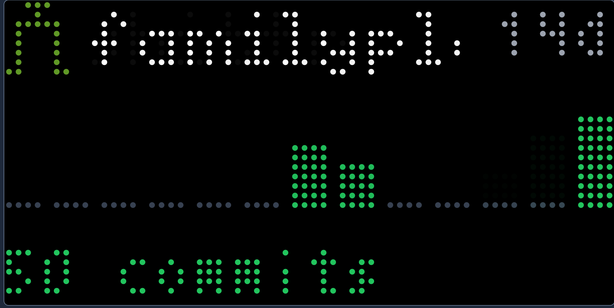
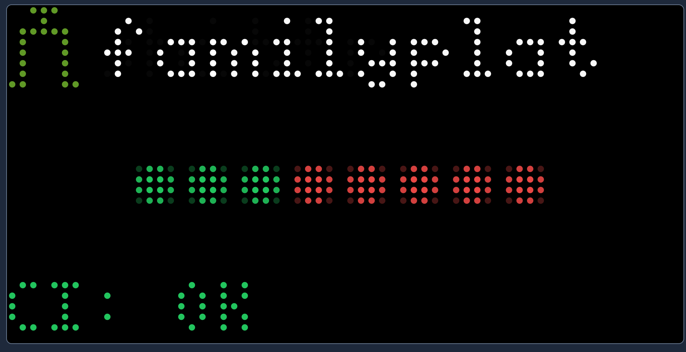

# Gitea Tidbyt/Tronbyt Apps

Pixlet applets for displaying Gitea repository statistics on [Tidbyt](https://tidbyt.com/) and [Tronbyt](https://github.com/tronbyt) displays.

> **Note:** Tidbyt was [acquired by Modal](https://hackaday.com/2025/03/29/open-source-framework-aims-to-keep-tidbyt-afloat/) in late 2024 and is no longer producing new devices. While existing cloud services continue for now, the future is uncertain. Consider using [Tronbyt](https://github.com/tronbyt) — an open-source replacement that lets you run these apps locally without cloud dependency.

## Screenshots

| Activity | CI Status |
|----------|-----------|
|  |  |

## Apps

### Gitea CI Status (`gitea_ci_status.star`)
Displays the status of recent CI/CD workflow runs with colored status dots.

- Shows up to 8 recent workflow runs as colored dots
- Green = success, Red = failure, Yellow = running, Blue = pending
- Displays latest run status and time ago

### Gitea Activity (`gitea_activity.star`)
Shows a 14-day commit activity sparkline for your repositories.

- Visual bar chart of daily commit counts
- Total commit count for the period
- Color-coded bars based on activity level

### Gitea Issues & PRs (`gitea_issues_prs.star`)
Displays open issue and pull request counts.

- Open issues count with amber indicator
- Open pull requests count with purple indicator
- Gray indicators when counts are zero

## Configuration

Each app accepts the following configuration options:

| Option | Description | Example |
|--------|-------------|---------|
| `gitea_url` | Your Gitea instance URL | `https://gitea.example.com` |
| `api_token` | Gitea personal access token | `your-token-here` |
| `repos` | Comma-separated list of repos | `owner/repo1,owner/repo2` |

## Usage

### Render an app
```bash
pixlet render gitea_ci_status.star \
  gitea_url="https://gitea.example.com" \
  api_token="your-token" \
  repos="owner/repo"
```

### Serve locally for preview
```bash
pixlet serve gitea_ci_status.star
```

### Push to Tidbyt device
```bash
pixlet push --installation-id gitea-ci <DEVICE_ID> gitea_ci_status.webp
```

## Using with Tronbyt

[Tronbyt](https://github.com/tronbyt) is an open-source ecosystem that frees your Tidbyt from cloud dependency:

1. **Flash your Tidbyt** with [Tronbyt firmware](https://github.com/tronbyt/firmware-esp32)
2. **Run the server** locally using [Tronbyt Server](https://github.com/tronbyt/server)
3. **Render apps** with [Tronbyt's Pixlet fork](https://github.com/tronbyt/pixlet)
4. **Push to your device** — apps run entirely on your local network

This gives you full control over your display without relying on external services.

## Requirements

- [Pixlet](https://github.com/tidbyt/pixlet) (or [Tronbyt Pixlet](https://github.com/tronbyt/pixlet)) CLI tool
- Gitea instance with API access
- Tidbyt/Tronbyt device for physical display

## License

See [LICENSE.txt](LICENSE.txt)
